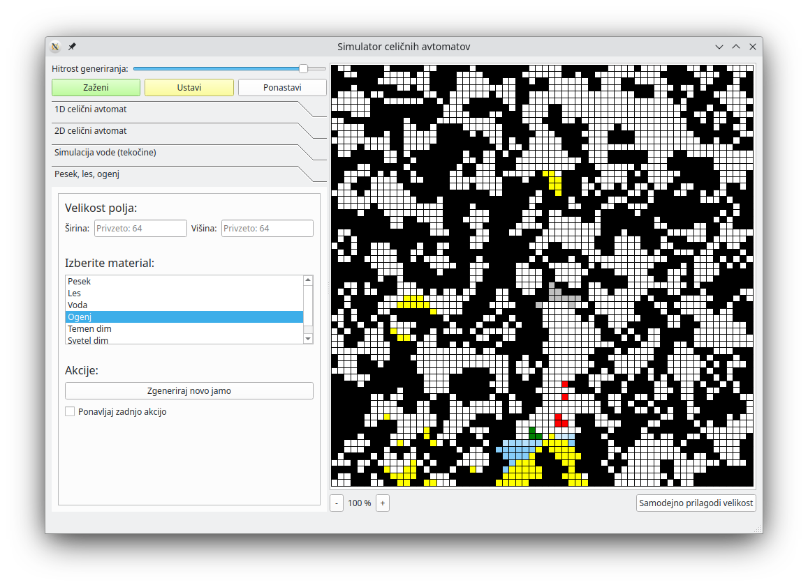

# Celični avtomat

Funkcionalnosti:
- 1D in 2D polja
- možnost spremembe velikosti polja
- Game of Life in možnost lastnih pravil
- generacija naključnih polj
- generiranje jam z pravilom B678/S2345678
- simulator tekočin
- simulacija jam z objekti:
  - les
  - pesek
  - voda
  - ogenj
  - dim

